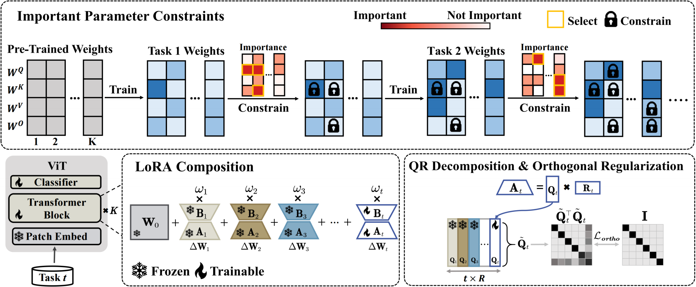

# :page_with_curl: A Close Look at Important Parameter Changes in Continual Learning under Orthogonal LoRA Tuning

This is the *Pytorch Implementation* for the paper:

> **A Close Look at Important Parameter Changes in Continual Learning under Orthogonal LoRA Tuning** <br>Shimou Ling, Liang Zhang, Jiangwei Zhao, Lili Pan, Hongliang Li <br>
> Pattern Recognition (submitted)

> **Abstract**:  LoRA-based continual learning represents a promising avenue for leveraging pre-trained models in downstream continual learning tasks. Recent studies have shown that orthogonal LoRA tuning effectively mitigates forgetting. However, this work unveils that the superabundance of potential orthogonal solutions in extremely high-dimensional parameter space can lead to sub-optimal solutions. To address this problem, we propose freezing the most critical parameter matrices in the Vision Transformer (ViT) for pre-tasks before learning post-tasks, defining parameter importance by their sensitivity to the training loss. Furthermore, we propose orthogonal LoRA composition (LoRAC) based on QR decomposition, which may enhance the plasticity of our method. Elaborate ablation studies and extensive comparisons demonstrate the effectiveness of our proposed method. Our results indicate that our method achieves state-of-the-art (SOTA) performance on several well-known continual learning benchmarks. For instance, on the Split CIFAR-100 dataset, our method shows a 6.35% improvement in accuracy and a 3.24% reduction in forgetting compared to previous methods.

<div align=center>

</div>

## 🔧 Dependencies and Installation
**Depedencies**
* Python >= 3.8 (Recommend to use [Anaconda](https://www.anaconda.com/download/#linux) or [Miniconda](https://docs.conda.io/en/latest/miniconda.html))
* Pytorch 2.0 or later. See [Pytorch]( https://pytorch.org) for install instructions.
* Linux (Ubuntu 20.04.3)

**Installation**

First, you can clone this repo using the command:

```shell 
git clone https://github.com/learninginvision/LoRAC-IPC
```

Then, you can create a virtual environment using conda, as follows:

```shell
conda env create -f environment.yaml
conda activate lorac-ipc
```

## :floppy_disk: Data preparation
We provide source about the datasets we use in our experiment as below:

| Dataset   | Dataset file                                                 |
| --------- | ------------------------------------------------------------ |
| Split CIFAR-100  | [CIFAR-100](http://www.cs.toronto.edu/~kriz/cifar-100-python.tar.gz) |
| Split ImageNet-R | [ImageNet-R](https://people.eecs.berkeley.edu/~hendrycks/imagenet-r.tar) |
| Split DomainNet| [DomainNet]( http://ai.bu.edu/M3SDA/) |
| 5-datasets | automatically be downloaded |

In addition, if you do not want to modify the code, please store the dataset in the path: `../dataset/` and make sure that the folder structure under this path is as follows:

```
├── CIFAR100
│   └── cifar-100-python
├── 5-datasets
│   ├── MNIST
│   ├── FashionMNIST
│   ├── notMNIST
│   ├── cifar-10-python
│   └── svhn
└── ImageNet-R
│   └── imagenet-r
│       └── train
│       └── test
└── Domain
    └── sketch
    └── real
    └── quickdraw
    └── painting
    └── infograph
    └── clipart
```
Following previous work, the files used to divide DomainNet have been placed under the path `./continual_datasets/splits`.

##  💻 Training
Run the following command to train the model sequentially:


```shell
bash ./training_scripts/train_{dataset}_vit_compilora_mask_{ptm}.sh
```
- `{dataset}`: The name of the dataset. (e.g. `cifar100`)
- `{ptm}`: The name of the pre-trained model. (e.g. `in21k`)


Additionally, the hyperparameters for training the model can be adjusted in the `./training_scripts/*.sh` file.

After training, you can get model checkpoints in the folder `./output/exp_name/checkpoints`, where `exp_name` is the name of the experiment including different hyperparameters.

## 📊 Evaluation
After completing training, the model's performance can be tested using the following command:


Without Task ID inference
```shell
bash ./testing_scripts/test_{dataset}_vit_compilora_{ptm}.sh
```
With Task ID inference
```shell
bash ./testing_scripts/test_{dataset}_vit_compilora_tii_{ptm}.sh
```

The result will be saved in the folder `./output/exp_name/eval_summary.txt`.

## 📈 Results

<div align="center">


*Results on Split CIFAR-100 and Split ImageNet-R in rehearsal-free class-incremental learning.*
</div>

## 📜 Acknowledgments

This code is built upon [thu-ml/HiDe-Prompt](https://github.com/thu-ml/HiDe-Prompt/), and refers to the following four projects:

[1] [L2P](https://github.com/JH-LEE-KR/l2p-pytorch)

[2] [Dual-Prompt](https://github.com/JH-LEE-KR/dualprompt-pytorch)

We thank the authors for releasing their code.